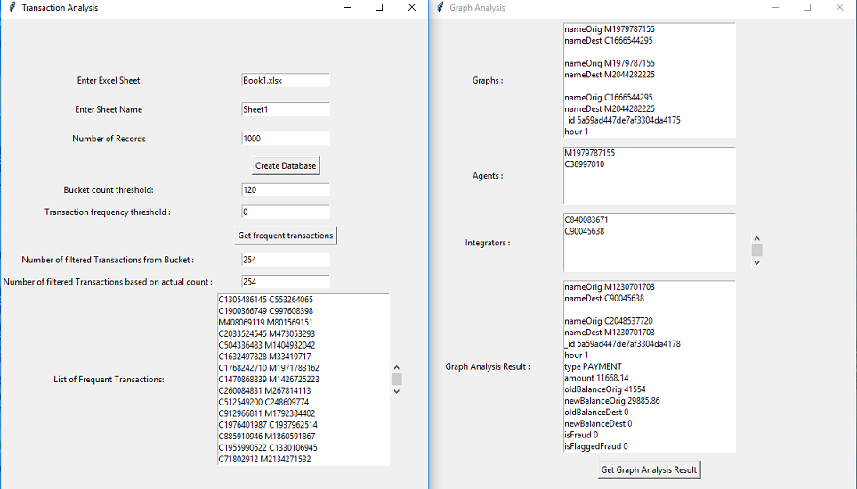
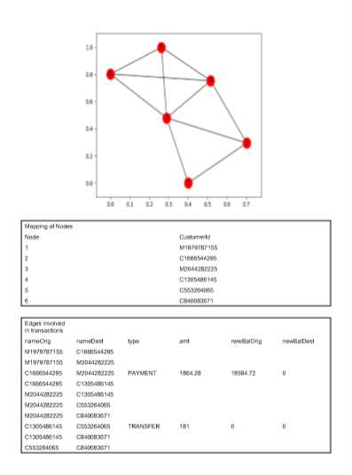
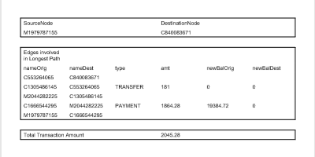

# Money-laundering-Detection-System
This project is built to identify money laundering cases in the layering stage. Basically there are two major techniques that have been applied to do this.First is identification of frequent transactions using Hash based Apriori Algorithm. Frequent transactions are identified by means of threshold values. Second is forming a connection between the involved customers and finding the amount of money laundered.

## Getting Started
* run Graph Analysis UI.py
* run Transaction Analysis UI.py

### Prerequisites
* Download and install Python(v>3).
* Download and install MongoDB and RoboMongo.
* Book1.xlsx contains all the banking transactions.
* Enter the number of records(in UI) you want to work on.(Those many number of record are inserted into MongoDB database)

